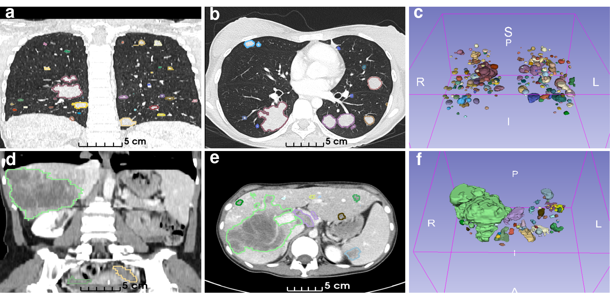

# recist-dataset
Description of a CT dataset containing 1,246 manually segmented lesions (tumors and lymph nodes), along with RECIST-compliant measurements for 82 target lesions.

<figure>
  
  <figcaption style="text-align: justify; max-width: 800px; margin: 0 auto;">
    <b>Examples of annotated lesions in CT images.</b> Each row corresponds to a series obtained from the same patient and CT study. (a-c) Thorax series. (d-f) Abdomen series. Each column shows a specific view of the same CT image, displaying annotated lesions in color. From left to right: coronal plane, axial plane, and 3d rendering.
  </figcaption>
</figure>
<br><br><br>

<figure>
  
  <figcaption style="text-align: justify; max-width: 800px; margin: 0 auto;">
    <b>Examples of annotated lesions in CT images.</b> Target lesion evolution over time, with automatically computed diameter lengths. (a) Lung metastasis. (b) Liver metastasis. The left column corresponds to the baseline study, while middle and right columns show subsequent follow-up studies. Major and minor axes are displayed in orange and magenta, respectively. The diameter length in millimeters, corresponding to the major axis in this case, is shown in orange next to the lesion identifier assigned at the patient level.
  </figcaption>
</figure>


## Index
For the community:
- [Download the dataset](#download-the-dataset)
- [Variables description](#variable-descriptions)
- [Set up the repository](#set-up-the-repository)
- [Normalize CT images](#normalize-ct-images)
- [Compute statistics](#compute-statistics)

For the contributors/maintainers:
- [How to get raw data](#how-to-get-raw-data)
- [How to obtain the final data from raw data](#how-to-obtain-the-final-data-from-raw-data)
- [Compute statistics](#compute-statistics)
- [Obtain sample images](#obtain-sample-images)
- [Obtain final dataset formatted to Zenodo](#obtain-final-dataset-formatted-to-zenodo)
- [Additional scripts](#additional-scripts)

## Download the dataset
The dataset is available on Zenodo ([https://doi.org/10.5281/zenodo.17788162](https://doi.org/10.5281/zenodo.17788162)) under a Creative Commons Attribution 4.0 International (CC BY 4.0) license. Download the files and extract the content from the `final-formatted.zip` file.


## Variable Descriptions

### RECIST measurements (`recist_measurements.csv`)
Each row corresponds to a target lesion assessed according to RECIST 1.1. The `recist_measurement_mm` column reports the lesion diameter.
All lesions are segmented, with the `lesion_label_value` indicating the corresponding foreground value in the segmentation mask.

| Variable Name     | Type        | Description                                                  | Example        |
|-------------------|-------------|--------------------------------------------------------------|----------------|
| `patient_id`      | Integer     | Pseudonymized identifier of the patient             		 | `1`       	  |
| `subset`          | String      | Subset assigned to the patient (`training`, `test`)          | `training`     |
| `study_date`      | String      | Date of the study in the format `YYYYMMDD`  			     | `20190220`     |
| `study_uuid`      | String      | Study Instance UID, corresponding to DICOM tag (`0020,000D`) | `1.3.51.0.1.1.172.19.3.128.3187796.3187735`|
| `uuid`            | String      | Series Instance UID, corresponding to DICOM tag (`0020,000E`)| `1.3.12.2.1107.5.1.4.83504.30000023042612315883400041810`|
| `filename`        | String 	  | Filename of the CT series    			          			 | `1.3.12.2.1107.5.1.4.83504.30000023042612315883400041810.nii.gz`|
| `region`          | String      | Anatomical region of the CT series (`abdomen`, `thorax`)     | `abdomen`      |
| `final_3d_objects`| Integer     | Total number of annotated lesions in the CT series           | `14`           |
| `lesion_label_value`| Integer   | Foreground value assigned to the lesion in the segmentation mask | `1`        |
| `lesion_label_alias`| String    | Alias used to identify a specific lesion within a patient    | `A`            |
| `recist_measurement_mm`| Integer| Diameter measurement in millimeters according to RECIST 1.1. For tumors, this is the major axis; for lymph nodes, the minor axis corresponding to the longest axis| `24`            |
| `study_order`     | String      | Temporal classification of the study (`baseline`, `follow-up-1`, `follow-up-2`, `...`) | `baseline` |


### Patient information (`patients.csv`)
Each row represents a unique patient.

| Variable Name     | Type        | Description                                                  | Example        |
|-------------------|-------------|--------------------------------------------------------------|----------------|
| `patient_id`      | Integer     | Pseudonymized identifier of the patient             		 | `1`       	  |
| `subset`          | Integer     | Subset assigned to the patient (`training`, `test`)          | `training`     |
| `first_study_date`| String      | Date of the first study (baseline) in the format `YYYYMMDD`  | `20190220`     |
| `sex`             | String 	  | Biological sex of the patient (`M`, `F`)    			     | `F`            |
| `age`             | Integer     | Age of the patient in years at the moment of the baseline study| `57`         |
| `diagnosis`       | String      | Clinical diagnosis assigned to the patient                   | `lung cancer`  |
| `histology`       | String      | Histological diagnosis of the patient, using standardized terms from the NCI Thesaurus (NCIt). If empty, it indicates missing or restricted information| `Adenocarcinoma`  |
| `health_insurance`| String      | Health insurance coverage (`public`, `private`, `uninsured`) | `public` |

### Series information (`series.json`)
List of dictionaries, where each dictionary corresponds to a CT series.

| Variable Name     | Type        | Description                                                  | Example        |
|-------------------|-------------|--------------------------------------------------------------|----------------|
| `id`      		| Integer     | Pseudonymized identifier of the CT series                    | `1`       	  |
| `region`          | String      | Anatomical region of the CT series (`abdomen`, `thorax`)     | `thorax`       |
| `uuid`            | String      | Series Instance UID, corresponding to DICOM tag (`0020,000E`)| `1.3.12.2.1107.5.1.4.83504.30000023042612315883400041810`|
| `study_uuid`      | String      | Study Instance UID, corresponding to DICOM tag (`0020,000D`) | `1.3.51.0.1.1.172.19.3.128.3187796.3187735`|
| `study_date`      | String      | Date of the study in the format `YYYYMMDD`  			     | `20221012`     |
| `patient_id`      | Integer     | Pseudonymized identifier of the patient             		 | `10`       	  |
| `slice_thickness` | Float       | Slice thickness (in `mm`) used during CT acquisition         | `1.5`          |
| `row_spacing`     | Float       | Voxel size (in `mm`) in the row dimension (Y-axis)           | `0.740234375`  |
| `column_spacing`  | Float       | Voxel size (in `mm`) in the column dimension (X-axis)        | `0.740234375`  |
| `slice_spacing`   | Float       | Voxel size (in `mm`) in the slice dimension (Z-axis)         | `1.0`          |
| `slices`          | Integer     | Number of slices in the volume							     | `340`          |
| `rows`            | Integer     | Number of rows per slice         					         | `512`          |
| `columns`         | Integer     | Number of columns per slice         						 | `512`          |


### Set up the repository
Set up the repository to run the provided scripts. For that:
1. Clone the repository and install the conda environment running `conda env create -f environment.yml`.
2. Run `conda activate recist-dataset`

**Note:** All the scripts have the `--help` flag available.

### Normalize CT images
Run the script `normalize_ct_images.py` to apply windowing-normalization to the CT images. The `windows_mapping.json` file is provided to properly normalize each CT image in the dataset.


### Compute statistics

Run the other scripts that compute statistics from the final dataset:
	- `get_nifti_metadata.py`: get information about image shape and voxel resolution.
	- `get_intensity_distributions.py`: get statistics from voxel intensities.
	- `compute_lesions_features.py`: get some features from individual lesion instances (longest axis, shortest axis, volume, mean intensity in HU).


## Only for contributors
Guidelines and scripts to replicate the final data from raw data, and to characterize the dataset.

### How to get raw data

#### Images
1. Go to the [FONDEF repository](https://github.com/covasquezv/FONDEF_ID23I10337/tree/dev/hcuch-data).
2. Download the CT series using the `get_data_from_orthanc.py` script with the flag `--format` to choose DICOM.
3. Unzip the resulting files using the `unzip_dicom_files.py` script.

#### Masks
1. Download the folder with annotations from [this link](https://sasiba.uchile.cl/index.php/apps/files/?dir=/2023_Fondef_ID23I10337/2023_2024_Fondef_ID23I10337_go/2025_Paper/data/source&fileid=23966378).
2. Extract the content.
3. Open a terminal and go to the [3D Slicer](https://download-slicer-org.translate.goog/?_x_tr_sl=en&_x_tr_tl=es&_x_tr_hl=es&_x_tr_pto=tc) folder.
4. Get the segmentations and CT images as nifti files running:

```./Slicer --no-main-window --testing --python-script path_to_script path_to_train_segmentations path_to_series path_to_output --suffix corrected```

```./Slicer --no-main-window --testing --python-script path_to_script path_to_test_segmentations path_to_series path_to_output --suffix standardized```

where `path_to_script` is the path to `get_segmentations_as_nifti.py` script in the [FONDEF repository](https://github.com/covasquezv/FONDEF_ID23I10337/tree/dev/slicer), `path_to_subset_segmentations` is the path to the folder containing train-val or test annotations, `path_to_series` is the path to the `series.json` after DICOM downloading, and `path_to_output` is the path to the output folder. Note that you apply this script twice to have train and test sets in different folders.

#### Build the raw folder
Create the following folder structure by using the images and masks obtained in the previous steps:
	<pre><code>
	📁 raw
	├── 📁 images
	│   ├── 📁 dicom
	│   │   ├── 📁 1/
	│   │   │   ├── 📁 3187796/
	│   │   │   │   ├── 📁 Portal   5.0  I30f  1   iMAR/
	│   │   │   │   │   ├── CT000000.dcm
	│   │   │   │   │   ├── CT000001.dcm
	│   │   │   │   │   └── ...
	│   │   │   |   └── ...
	│   │   │   └── ...
	│   │   └── ...
	│   └── 📁 nifti
	│       ├── 📁 train
	│       │   ├── 📁 images
	│       │   │   ├── case001.nii.gz
	│       │   │   ├── case002.nii.gz
	│       │   │   └── ...
	│       │   ├── 📁 labels
	│       │   │   ├── case001.json
	│       │   │   ├── case002.json
	│       │   │   └── ...
	│       │   ├── 📁 masks
	│       │   │   ├── case001.nii.gz
	│       │   │   ├── case002.nii.gz
	│       │   │   └── ...
	│       └── 📁 test
	│           ├── 📁 images
	│           ├── 📁 labels
	│           └── 📁 masks
	├── 📁 metadata
	│   ├── patients.csv
	│   ├── series.json
	│   └── windows_mapping.json
	└── recist_measurements.csv
	</code></pre>

Some notes:
- The files inside the `dicom` folder are the obtained in the [Images](#images) subsection.
- The files inside the `nifti` folder are the obtained in the [Masks](#masks) subsection.
- The filenames of images, labels and masks are based on the DICOM tag “Series Instance UID” `(0020,000E)`. We ommitted that from the visual representation for simplicity.
- The `recist_measurements.csv` file needs to be downloaded from [here](https://sasiba.uchile.cl/index.php/apps/files/?dir=/2023_Fondef_ID23I10337/2023_2024_Fondef_ID23I10337_go/2025_Paper/data/source&fileid=23966378)
- Regarding metadata files:
	- `patients.csv` needs to be downloaded from [here](https://sasiba.uchile.cl/index.php/apps/files/?dir=/2023_Fondef_ID23I10337/2023_2024_Fondef_ID23I10337_go/2025_Paper/data/source&fileid=23966378).
	- `series.json` was obtained in the `Images` subsection using the `get_data_from_orthanc.py` script.
	- `windows_mapping.json` is obtained using the `create_windows_mapping.py` from the [FONDEF repository](https://github.com/covasquezv/FONDEF_ID23I10337/tree/dev/hcuch-data).


### How to obtain the final data from raw data

1. Run the `get_final_metadata.py` script to get the final version of all metadata files.
2. Convert DICOM (`.dcm`) files of CT series into compressed NIfTI (`.nii.gz`) files using the `convert_dicom_to_nifti.py` script. Make sure to select the final versions of `series.json` and `patients.csv`.
3. Replace the resulting train and test `images` in the corresponding folders inside the `raw`folder (`raw/images/nifti/train/images` for train, `raw/images/nifti/test/images` for test). **Note:** Steps 2 and 3 are required because for the rest of the community, the NIfTI files can only be obtained from the DICOM files.
4. Run `get_3d_instance_annotated_lesions.py` script to convert `raw` annotated data to `final` annotated data, containing masks with individual lesion instances. See the help using the flag `-h` to
understand the input arguments. **Note:** You have to run this script separately for the train and test sets.
5. Copy the `raw/images/nifti/train/images` and `raw/images/nifti/test/images` folders containing the CT series in nifti format to their corresponding locations in the `final` folder.
6. Make sure to have the following folder structure:
	<pre><code>
	📁 final
	├── 📁 images
	│   ├── 📁 train
	│   |   ├── 📁 images
	│   |   │   ├── case001.nii.gz
	│   |   │   ├── case002.nii.gz
	│   |   │   └── ...
	│   |   ├── 📁 labels
	│   |   │   ├── case001.json
	│   |   │   ├── case002.json
	│   |   │   └── ...
	│   |   └── 📁 masks
	│   |       ├── case001.nii.gz
	│   |       ├── case002.nii.gz
	│   |       └── ...
	│   └── 📁 test
	│       ├── 📁 images
	│       ├── 📁 labels
	│       └── 📁 masks
	├── 📁 metadata
	│   ├── patients.csv
	│   ├── series.json
	│   └── windows_mapping.json
	└── recist_measurements.csv
	</code></pre>
7. Go to the [FONDEF repository](https://github.com/covasquezv/FONDEF_ID23I10337/tree/dev/hcuch-data) and use the script `filter_dicom_files.py` to select only the DICOM files of final patients. Then, copy the resulting data into the `raw/images/dicom/` folder.

### Compute statistics

1. Run the other scripts that compute statistics from final dataset:
	- `get_nifti_metadata.py`: get information about image shape and voxel resolution.
	- `get_intensity_distributions.py`: get statistics from voxel intensities.
	- `compute_lesions_features.py`: get some features from individual lesion instances (longest axis, shortest axis, volume, mean intensity in HU).

2. Update all output files used by the jupyter notebooks in the `notebooks` folder.

### Obtain sample images

The following scripts are intended to generate png images of
the final data or results obtained from experiments for the journal
submission:

- `extract_target_rois.py`: extract 2D ROIs centered on the target lesions, including the overlaying of diameter lengths. Diameter lengths
are computed fitting an ellipse.
- `extract_medsam_rois.py`: extract 2D ROIs of connected components overlaying the expert annotated countours (ground truth) and the contours
obtained from the MedSAM prediction.
- `get_images_nnunet_results.py`: extract renderings of the test CT images
used for automatic liver and lung tumor segmentation using the nnUNet. The
expert annotated and the predicted masks are also rendered.


### Obtain final dataset formatted to Zenodo
A final step is required to produce the dataset in the format requested by the Editor and Reviewers. To generate the `final-formatted` dataset folder, run the script `format_final_folder.py`.


### Additional scripts

- `get_lesions_info_from_other_datasets.py`: extract information of the
lesion instances included in the datasets that were used to train MedSAM.